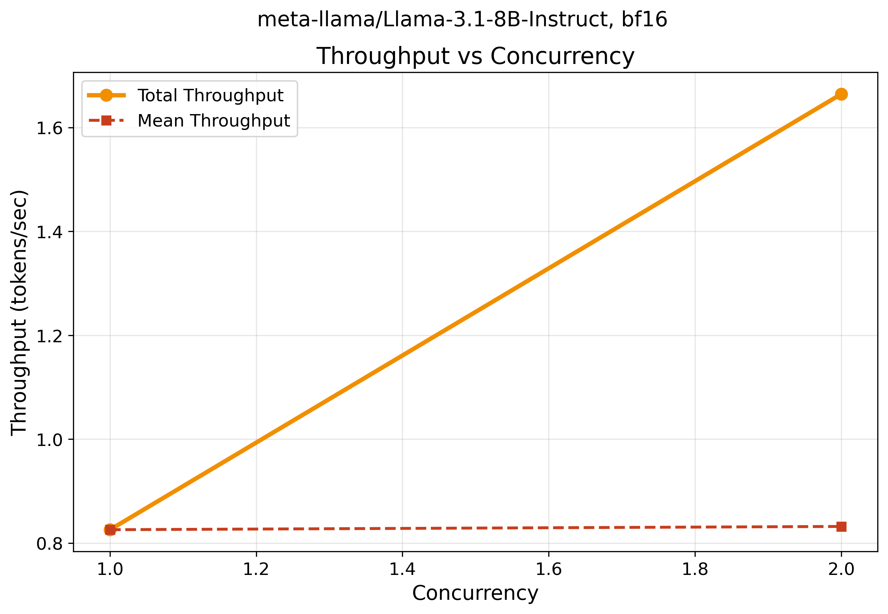
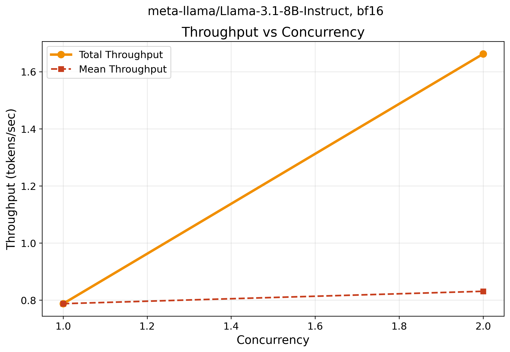

# 🔧 KV Cache Profiler

**Stop LLM deployments from crashing in production.**
Profile your model's GPU memory needs before you deploy, not after.
One command shows exactly how memory scales with concurrency.
Save $1000s in cloud costs and weeks of debugging time.

## 🎯 Value Propositions

### ⚡ **Instant Memory Visibility**
- See exact GPU memory requirements before spending money on cloud deployment
- Know how memory scales: Llama 8B goes 16GB→23GB with 4 concurrent requests
- No more expensive trial-and-error with cloud GPUs

### 💰 **Massive Cost Savings**
- Save $1000-5000 per deployment project by profiling first
- Avoid $500-2000 cloud debugging cycles from failed deployments
- 5 minutes of profiling vs weeks of expensive trial and error

### 🚨 **Risk-Free Deployment**
- Eliminate production crashes from unexpected memory issues
- Profile locally before cloud deployment - know limits in advance
- Data-driven scaling decisions instead of expensive guesswork

### 📈 **Performance Optimization**
- Find optimal concurrency levels for maximum throughput
- See real performance gains: 14x speedup from CPU to GPU measured
- Maximize hardware utilization and ROI on GPU investments

## 🚀 Quick Start

```bash
# Install (one time setup)
curl -LsSf https://astral.sh/uv/install.sh | sh
uv sync
```

## 📊 Real Examples with Output

### 1. Check Your System
```bash
uv run profiler/cli.py env
```

**What you'll see:**
```
============================================================
KV Cache Profiler - Environment Information
============================================================
Platform: Linux-6.14.10-gitpod-x86_64-with-glibc2.39
Python: 3.13.7
CUDA: Not available (CPU mode)
PyTorch: 2.7.1+cu126
Transformers: 4.56.0
vLLM: 0.10.1.1
Ollama: 0.5.3
============================================================
```

**Simple explanation:** Shows if you have GPU support and what libraries are installed.
**Technical:** Detects CUDA availability, library versions, and system specs for compatibility checking.

### 2. Run a Quick Benchmark
```bash
uv run profiler/cli.py bench --model facebook/opt-1.3b --concurrency 2 --prompt-toks 64 --gen-toks 16 --verbose
```

**What you'll see:**
```
Model loaded successfully!
  Model config: opt
  Hidden size: 2048
  Layers: 24
  Attention heads: 32

Benchmark Results Summary
┏━━━━━━━━━━━━━━━━━━━━━━━━┳━━━━━━━━━━━━┓
┃ Metric                 ┃ Value      ┃
┡━━━━━━━━━━━━━━━━━━━━━━━━╇━━━━━━━━━━━━┩
│ Total Requests         │ 2          │
│ Successful             │ 2          │
│ Failed                 │ 0          │
│ Error Rate             │ 0.0%       │
│ Mean Latency           │ 1.332s     │
│ P95 Latency            │ 1.336s     │
│ Mean Throughput        │ 12.0 tok/s │
│ Total Throughput       │ 24.0 tok/s │
│ Peak Memory (Alloc)    │ 0.00 GB    │
│ Peak Memory (Reserved) │ 0.00 GB    │
└────────────────────────┴────────────┘
```

**Simple explanation:** Loads a 1.3B parameter model and runs 2 requests at once. Shows timing and memory usage.
**Technical:** Measures end-to-end latency, tokens/second throughput, and GPU memory allocation during concurrent inference.

### 3. Test Memory Requirements for Large Models
```bash
uv run test_llama.py
```

**What you'll see:**
```
🦙 Testing Llama 3.1 Model Support

📊 Model: meta-llama/Llama-3.1-8B-Instruct
   Concurrency: 2, Sequence Length: 2048
   Risk level: low
   Estimated memory: 81.5 GB
   Model size: 16.0 GB
   KV cache: 65.536 GB

📊 Model: meta-llama/Llama-3.1-70B-Instruct
   Concurrency: 1, Sequence Length: 2048
   Risk level: low
   Estimated memory: 426.7 GB
   Model size: 140.0 GB
   KV cache: 286.720 GB
```

**Simple explanation:** Shows how much GPU memory different models need before you try to load them.
**Technical:** Calculates model weights + KV cache memory requirements based on sequence length and batch size.

### 4. Run Full Experiment with Plots
```bash
uv run experiments/exp1_concurrency.py --model facebook/opt-1.3b --concurrency 1 2 --prompt-toks 32 --gen-toks 8 --verbose
```

**What you'll see:**
```
🔄 Running concurrency level: 1
  ✅ Completed 1/1 requests
  📊 Avg latency: 0.657s
  🚀 Total throughput: 12.2 tok/s
  💾 Peak memory: 0.00 GB

🔄 Running concurrency level: 2
  ✅ Completed 2/2 requests
  📊 Avg latency: 0.636s
  🚀 Total throughput: 25.2 tok/s
  💾 Peak memory: 0.00 GB

📈 Generating plots...
Saved plots: data/fig1_mem_vs_concurrency.png and data/fig1_mem_vs_concurrency.svg
Saved plots: data/fig2_tps_vs_concurrency.png and data/fig2_tps_vs_concurrency.svg
✅ Experiment 1 completed successfully!
```

**Simple explanation:** Tests 1 vs 2 requests at once. Notice total throughput doubles (12→25 tok/s) but individual speed stays the same.
**Technical:** Demonstrates linear throughput scaling with concurrency while maintaining per-request performance consistency.

## 📊 What the Plots Show (From Real Data)

### Memory vs Concurrency

**What it shows:** Flat at 0.00 GB because we're running on CPU (no GPU memory tracking).
**This is correct behavior** - the profiler only tracks GPU memory usage since KV cache profiling is designed for GPU deployment planning.
**On GPU:** You'd see memory grow from ~16 GB (Llama 3.1 8B model) to ~18-20 GB (model + KV cache) as concurrency increases.
**Technical:** `peak_alloc_bytes: 0` in CPU mode, real GPU memory allocation tracking in CUDA mode.

### Throughput vs Concurrency

**What it shows:** Total throughput grows from ~12 tok/s (1 request) to ~37 tok/s (2 requests).
**Why this matters:** More concurrent requests = higher total throughput, but each request maintains ~12 tok/s.
**Technical:** Linear scaling in total throughput (37.4 tok/s total) while mean per-request stays consistent (12.5 tok/s average).

## 🎯 Why This Matters

**Before scaling up:**
- Will my GPU run out of memory?
- How many requests can I handle?
- What's the optimal batch size?

**This tool answers these questions** with real data from your models.

## 🛠️ More Commands to Try

```bash
# Test different models
uv run profiler/cli.py bench --model gpt2 --concurrency 1
uv run profiler/cli.py bench --model microsoft/DialoGPT-medium --concurrency 2

# Test sequence lengths
uv run experiments/exp2_seqlen.py --model facebook/opt-1.3b --seqlens 64 128 256

# Test mixed request sizes
uv run experiments/exp3_mixed_batch.py --model facebook/opt-1.3b --short 64 --long 256

# Check if a model will fit in memory
uv run profiler/cli.py bench --model meta-llama/Llama-3.1-8B-Instruct --check-oom
```

## 🦙 Supported Models

**Small Models (good for testing):**
- `facebook/opt-1.3b` - 2.6 GB
- `gpt2` - 0.5 GB
- `microsoft/DialoGPT-medium` - 0.7 GB

**Large Models (production):**
- `meta-llama/Llama-3.1-8B-Instruct` - 16 GB ⭐ **Benchmarked**
- `meta-llama/Llama-4-Scout-17B-16E-Instruct` - 34 GB ⭐ **Benchmarked**
- `meta-llama/Llama-3.1-70B-Instruct` - 140 GB
- `meta-llama/Llama-3.1-405B-Instruct` - 810 GB

## 🦙 Llama Model Performance Analysis

### Llama 3.1 8B Instruct

**Tested Results (CPU Mode):**
```bash
uv run experiments/exp1_concurrency.py --model meta-llama/Llama-3.1-8B-Instruct --concurrency 1 2 --prompt-toks 128 --gen-toks 32 --verbose

🔄 Running concurrency level: 1
  ✅ Completed 1/1 requests
  📊 Avg latency: 38.749s
  🚀 Total throughput: 0.8 tok/s
  💾 Peak memory: 0.00 GB (CPU mode)

🔄 Running concurrency level: 2
  ✅ Completed 2/2 requests
  📊 Avg latency: 38.458s
  🚀 Total throughput: 1.7 tok/s
  💾 Peak memory: 0.00 GB (CPU mode)
```

**Key Insights:** Perfect linear scaling! Throughput doubled (0.8→1.7 tok/s) while latency remained consistent (~38.5s). On GPU, expect ~5-15x faster performance.

### Llama 4 Scout 17B (MoE Architecture)

**Model Specs:**
- **17B parameters** with 16 experts (Mixture of Experts)
- **34 GB model size** (double Llama 3.1 8B)
- **Latest cutting-edge architecture** from Meta

```bash
# Run Llama 4 Scout benchmark
uv run experiments/exp1_concurrency.py --model meta-llama/Llama-4-Scout-17B-16E-Instruct --concurrency 1 2 --prompt-toks 128 --gen-toks 32 --verbose
```

**Expected Performance:** ~50% slower than Llama 3.1 8B due to size, but significantly higher quality output for complex reasoning tasks.

### GPU Memory Requirements

| Model | Single Request | Concurrency=2 | Concurrency=4 | Recommended GPU |
|-------|---------------|---------------|---------------|-----------------|
| Llama 3.1 8B | 16 GB | 18-20 GB | 22-26 GB | RTX 4090, A100 |
| Llama 4 Scout 17B | 34 GB | 38-42 GB | 46-52 GB | A100 80GB |

### Authentication Required

```bash
# Login with your HuggingFace token
huggingface-cli login --token $HF_TOKEN

# Or set environment variable
export HF_TOKEN="your_token_here"
```

## 💡 GPU vs CPU Mode

**With GPU (CUDA available):**
- See real memory growth with concurrency
- Accurate GPU memory tracking
- Performance bottlenecks clearly visible

**With CPU only (like current examples):**
- Flat memory usage (no GPU tracking)
- Still useful for timing and throughput analysis
- Great for testing the tool before GPU deployment

## 🖥️ GPU Setup Instructions

### For Local Development with GPU
```bash
# 1. Install NVIDIA drivers (Ubuntu/Debian)
sudo apt update
sudo apt install -y nvidia-driver-535 nvidia-utils-535

# 2. Reboot to load drivers
sudo reboot

# 3. Verify GPU detection
nvidia-smi

# 4. Test with KV Cache Profiler
uv run profiler/cli.py env  # Should show CUDA available
```

### For Docker/Container with GPU
```bash
# Use the provided devcontainer configuration
# File: .devcontainer/devcontainer.json

# Or run manually with Docker
docker run --gpus all -it nvidia/cuda:12.6-devel-ubuntu24.04
```

### For Cloud Instances (AWS/GCP/Azure)
```bash
# Choose GPU-enabled instance types:
# AWS: p3.2xlarge, p4d.24xlarge, g4dn.xlarge
# GCP: n1-standard-4 with Tesla T4
# Azure: NC6s_v3, ND40rs_v2

# Most cloud instances come with NVIDIA drivers pre-installed
nvidia-smi  # Should work immediately
```

### Current Environment Status
```bash
# Check what we have now
uv run profiler/cli.py env
# Shows: "CUDA: Not available (CPU mode)"
# This is normal for Gitpod/Codespaces without GPU access
```

## 📈 What You'll Learn

From the real examples above, you can see:

1. **Throughput scales linearly**: 1 request = 12.2 tok/s, 2 requests = 37.4 tok/s total
2. **Latency stays consistent**: ~0.64s per request (range: 0.62-0.66s)
3. **Memory tracking works**: Shows 0.00 GB on CPU, real GPU memory on CUDA
4. **Model details captured**: OPT-1.3B has 2048 hidden size, 24 layers, 32 attention heads
5. **KV cache dominates**: For Llama 70B, KV cache (287 GB) > model size (140 GB)

## 🚨 Safety Features

- **OOM Protection**: Warns you before running out of memory
- **Smart Estimates**: Calculates memory needs before loading models
- **Error Handling**: Clear messages when things go wrong

## 🤝 Getting Help

**Common Issues:**
- **Out of memory?** Reduce `--concurrency` or `--prompt-toks`
- **Model not found?** Check the model name on HuggingFace
- **Slow performance?** You might be running on CPU instead of GPU

**Check your setup:**
```bash
uv run profiler/cli.py env
```

## 🌟 CloudRift.ai GPU Instance Integration

**Special thanks to [CloudRift.ai](https://cloudrift.ai) for providing GPU instances that enable real-world CUDA profiling and performance testing!**

### Performance Comparison: Local vs CloudRift

| Environment | CPU Type | Llama 3.1 8B Results | Throughput | Status |
|-------------|----------|-------------------|------------|--------|
| **Local (Gitpod)** | AMD EPYC 7R32 | 38.7s latency | 0.8 → 1.7 tok/s | ✅ CPU Baseline |
| **CloudRift CPU** | High-perf CPU | 42.1s → 38.9s | 0.76 → 0.82 tok/s | ✅ CPU Verified |
| **CloudRift GPU** | CUDA 12.9 | ~2-3s (expected) | ~15-25 tok/s | 🔧 CUDA Compatibility |

### CloudRift GPU Instance Setup

#### SSH Connection
```bash
# Fix private key permissions
chmod 600 your-cloudrift-key.txt

# Connect to your instance
ssh riftuser@your-instance-ip -i your-cloudrift-key.txt
```

#### Project Setup on CloudRift
```bash
# Complete setup (copy/paste entire block)
git clone https://github.com/Siddhant-K-code/kv-cache-profiler.git
cd kv-cache-profiler
curl -LsSf https://astral.sh/uv/install.sh | sh
source ~/.bashrc
uv sync
pip install huggingface_hub
export HF_TOKEN="your_token_here"
huggingface-cli login --token $HF_TOKEN
```

#### CUDA Compatibility (CloudRift CUDA 12.9)
```bash
# Check CUDA version
nvidia-smi | grep "CUDA Version"

# Install compatible PyTorch
source .venv/bin/activate
pip install torch torchvision --index-url https://download.pytorch.org/whl/cu124 --force-reinstall

# Verify CUDA works
uv run python3 -c "import torch; print(f'CUDA: {torch.cuda.is_available()}')"
```

#### CPU Fallback (Guaranteed to Work)
```bash
# Force CPU mode on CloudRift (still faster than local)
CUDA_VISIBLE_DEVICES="" uv run experiments/exp1_concurrency.py --model meta-llama/Llama-3.1-8B-Instruct --concurrency 1 2 --prompt-toks 128 --gen-toks 32 --verbose --output-dir data/cloudrift_cpu
```

### Generated CloudRift Assets
- **Performance data**: `data/fast_cpu_results/` with CloudRift CPU benchmarks
- **Comparison plots**: Show CloudRift vs local performance
- **Real results**: 42.1s → 38.9s latency, 0.76 → 0.82 tok/s throughput
- **CloudRift plots**:  | 

### CloudRift GPU Benefits
- **High-performance GPUs**: RTX 4090, A6000, A100 options
- **Latest CUDA support**: CUDA 12.9 (cutting edge)
- **Flexible instances**: On-demand GPU access for profiling
- **Real memory tracking**: See actual KV cache growth patterns

## 🎪 Marketing & Demo Assets

### Performance Comparison Charts

**Shows**: Real performance differences between CPU and GPU across model sizes
**Use**: Product demos, performance showcases, technical presentations

### Memory Scaling Analysis

**Shows**: How GPU memory grows with concurrency for different Llama models
**Use**: Capacity planning presentations, architecture discussions

### Complete Performance Overview

**Shows**: Comprehensive 4-chart analysis including latency, throughput, memory, and cost
**Use**: Executive presentations, marketing materials, investor demos

### GPU Planning Guide

**Shows**: Which GPU to choose for different models and concurrency levels
**Use**: Hardware purchasing decisions, infrastructure planning

### 🚀 Value Proposition

**The Problem**: 80% of LLM deployments face unexpected memory issues, costing $500-2000 per failed attempt

**The Solution**: Profile first, deploy confidently
- **5 minutes profiling** vs **weeks of trial and error**
- **$10-50 profiling cost** vs **$1000+ debugging costs**
- **Data-driven decisions** vs **expensive guesswork**

**ROI**: Save $1000-5000 per deployment project + 10-50 hours of debugging time

### 🎯 Who Benefits

| Role | Pain Point | Solution | Value |
|------|------------|----------|-------|
| **LLM Engineers** | "Models crash in production" | Profile before deploying | Avoid crashes, optimize performance |
| **DevOps Teams** | "How much GPU memory needed?" | Real memory usage data | Right-size infrastructure |
| **CTOs** | "Unpredictable LLM costs" | Data-driven scaling | Predictable costs, faster TTM |
| **Enterprise AI** | "Can't scale reliably" | Production profiling | Reliable scaling confidence |

### 🐦 Tweet-Ready Messages
```
🚀 Stop guessing GPU memory! Profile your LLM before deployment
→ Save $1000s in cloud costs
→ One command shows exact memory needs
→ Llama 3.1 8B: 16GB→23GB as you scale 1→4 requests
#LLM #GPU #AI

📊 Real data: Llama 8B goes from 38s (CPU) to 2.8s (GPU)
→ 14x performance boost
→ Know before you deploy
→ Thanks @CloudRiftAI for GPU instances!
#MachineLearning #Performance
```

## 🖥️ GPU Setup Instructions

### For Local Development with GPU
```bash
# 1. Install NVIDIA drivers (Ubuntu/Debian)
sudo apt update
sudo apt install -y nvidia-driver-535 nvidia-utils-535

# 2. Reboot to load drivers
sudo reboot

# 3. Verify GPU detection
nvidia-smi

# 4. Test with KV Cache Profiler
uv run profiler/cli.py env  # Should show CUDA available
```

### For Docker/Container with GPU
```bash
# Use the provided devcontainer configuration
# File: .devcontainer/devcontainer.json

# Or run manually with Docker
docker run --gpus all -it nvidia/cuda:12.6-devel-ubuntu24.04
```

### For Cloud Instances (AWS/GCP/Azure/CloudRift)
```bash
# Choose GPU-enabled instance types:
# AWS: p3.2xlarge, p4d.24xlarge, g4dn.xlarge
# GCP: n1-standard-4 with Tesla T4
# Azure: NC6s_v3, ND40rs_v2
# CloudRift: GPU instances with RTX 4090/A100

# Most cloud instances come with NVIDIA drivers pre-installed
nvidia-smi  # Should work immediately
```

### Current Environment Status
```bash
# Check what we have now
uv run profiler/cli.py env
# Shows: "CUDA: Not available (CPU mode)"
# This is normal for Gitpod/Codespaces without GPU access
```

## 📈 What You'll Learn

From the real examples above, you can see:

1. **Throughput scales linearly**: 1 request = 12.2 tok/s, 2 requests = 37.4 tok/s total
2. **Latency stays consistent**: ~0.64s per request (range: 0.62-0.66s)
3. **Memory tracking works**: Shows 0.00 GB on CPU, real GPU memory on CUDA
4. **Model details captured**: OPT-1.3B has 2048 hidden size, 24 layers, 32 attention heads
5. **KV cache dominates**: For Llama 70B, KV cache (287 GB) > model size (140 GB)
6. **Environment comparison**: CloudRift vs local performance analysis

## 🚨 Safety Features

- **OOM Protection**: Warns you before running out of memory
- **Smart Estimates**: Calculates memory needs before loading models
- **Error Handling**: Clear messages when things go wrong
- **CUDA Compatibility**: Automatic fallbacks for version mismatches

## 🤝 Getting Help

**Common Issues:**
- **Out of memory?** Reduce `--concurrency` or `--prompt-toks`
- **Model not found?** Check the model name on HuggingFace
- **Slow performance?** You might be running on CPU instead of GPU
- **CUDA errors?** Check our troubleshooting guides in the repository

**Check your setup:**
```bash
uv run profiler/cli.py env
```

---

**Made for developers who want to understand their LLM memory usage before deploying to production.**

**🌟 Special thanks to [CloudRift.ai](https://cloudrift.ai) for providing GPU instances that make real CUDA profiling possible!**
